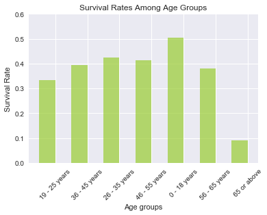
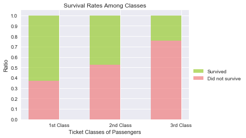
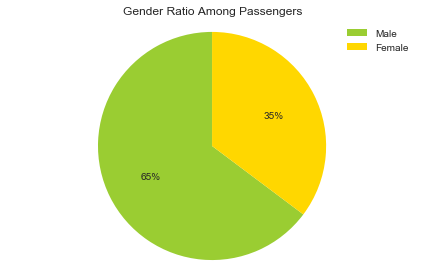
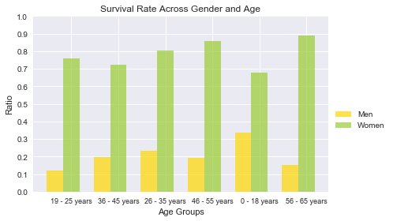

# Analyzing Titanic Dataset with Python

I am interested in analyzing the **Titanic Dataset** and try to answer the following questions: 

- **Which age group had a better chance of surviving? Did any age group got any privilages in the evacuation?**

- **Which gender had a better chance of surviving?**

- **Did wellfare have any affect on the survival rate?**


Let's start by importing all the necessary libraries for the project:


```python
import matplotlib.pyplot as plt
import numpy as np
import pandas as pd
import seaborn as sns
%pylab inline
```

    Populating the interactive namespace from numpy and matplotlib


For the project I will use the titanic dataset so let's also import the csv file into our jupyter notebook


```python
titanic_data = pd.read_csv('titanic-data.csv')
```

Next, let's take a peek at the data set that we imported to come up with meaningful questions for analysis.


```python
titanic_data.head(n = 10)
```


<div>
<table border="1" class="dataframe">
  <thead>
    <tr style="text-align: right;">
      <th></th>
      <th>PassengerId</th>
      <th>Survived</th>
      <th>Pclass</th>
      <th>Name</th>
      <th>Sex</th>
      <th>Age</th>
      <th>SibSp</th>
      <th>Parch</th>
      <th>Ticket</th>
      <th>Fare</th>
      <th>Cabin</th>
      <th>Embarked</th>
    </tr>
  </thead>
  <tbody>
    <tr>
      <th>0</th>
      <td>1</td>
      <td>0</td>
      <td>3</td>
      <td>Braund, Mr. Owen Harris</td>
      <td>male</td>
      <td>22.0</td>
      <td>1</td>
      <td>0</td>
      <td>A/5 21171</td>
      <td>7.2500</td>
      <td>NaN</td>
      <td>S</td>
    </tr>
    <tr>
      <th>1</th>
      <td>2</td>
      <td>1</td>
      <td>1</td>
      <td>Cumings, Mrs. John Bradley (Florence Briggs Th...</td>
      <td>female</td>
      <td>38.0</td>
      <td>1</td>
      <td>0</td>
      <td>PC 17599</td>
      <td>71.2833</td>
      <td>C85</td>
      <td>C</td>
    </tr>
    <tr>
      <th>2</th>
      <td>3</td>
      <td>1</td>
      <td>3</td>
      <td>Heikkinen, Miss. Laina</td>
      <td>female</td>
      <td>26.0</td>
      <td>0</td>
      <td>0</td>
      <td>STON/O2. 3101282</td>
      <td>7.9250</td>
      <td>NaN</td>
      <td>S</td>
    </tr>
    <tr>
      <th>3</th>
      <td>4</td>
      <td>1</td>
      <td>1</td>
      <td>Futrelle, Mrs. Jacques Heath (Lily May Peel)</td>
      <td>female</td>
      <td>35.0</td>
      <td>1</td>
      <td>0</td>
      <td>113803</td>
      <td>53.1000</td>
      <td>C123</td>
      <td>S</td>
    </tr>
    <tr>
      <th>4</th>
      <td>5</td>
      <td>0</td>
      <td>3</td>
      <td>Allen, Mr. William Henry</td>
      <td>male</td>
      <td>35.0</td>
      <td>0</td>
      <td>0</td>
      <td>373450</td>
      <td>8.0500</td>
      <td>NaN</td>
      <td>S</td>
    </tr>
    <tr>
      <th>5</th>
      <td>6</td>
      <td>0</td>
      <td>3</td>
      <td>Moran, Mr. James</td>
      <td>male</td>
      <td>NaN</td>
      <td>0</td>
      <td>0</td>
      <td>330877</td>
      <td>8.4583</td>
      <td>NaN</td>
      <td>Q</td>
    </tr>
    <tr>
      <th>6</th>
      <td>7</td>
      <td>0</td>
      <td>1</td>
      <td>McCarthy, Mr. Timothy J</td>
      <td>male</td>
      <td>54.0</td>
      <td>0</td>
      <td>0</td>
      <td>17463</td>
      <td>51.8625</td>
      <td>E46</td>
      <td>S</td>
    </tr>
    <tr>
      <th>7</th>
      <td>8</td>
      <td>0</td>
      <td>3</td>
      <td>Palsson, Master. Gosta Leonard</td>
      <td>male</td>
      <td>2.0</td>
      <td>3</td>
      <td>1</td>
      <td>349909</td>
      <td>21.0750</td>
      <td>NaN</td>
      <td>S</td>
    </tr>
    <tr>
      <th>8</th>
      <td>9</td>
      <td>1</td>
      <td>3</td>
      <td>Johnson, Mrs. Oscar W (Elisabeth Vilhelmina Berg)</td>
      <td>female</td>
      <td>27.0</td>
      <td>0</td>
      <td>2</td>
      <td>347742</td>
      <td>11.1333</td>
      <td>NaN</td>
      <td>S</td>
    </tr>
    <tr>
      <th>9</th>
      <td>10</td>
      <td>1</td>
      <td>2</td>
      <td>Nasser, Mrs. Nicholas (Adele Achem)</td>
      <td>female</td>
      <td>14.0</td>
      <td>1</td>
      <td>0</td>
      <td>237736</td>
      <td>30.0708</td>
      <td>NaN</td>
      <td>C</td>
    </tr>
  </tbody>
</table>
</div>


Before we start investing hypotheses, it makes sense to check for NULL values in the columns 


```python
print(titanic_data.isnull().any())
```

    PassengerId    False
    Survived       False
    Pclass         False
    Name           False
    Sex            False
    Age             True
    SibSp          False
    Parch          False
    Ticket         False
    Fare           False
    Cabin           True
    Embarked        True
    dtype: bool


As can be seen from the code above, the columns '**Age**', '**Cabin**' and '**Embarked**' have NULL values. Once working on the dataset, we have to be careful if we are using those columns. Below are the number of NULL values per columns:


```python
print('Number of NULL values in Age column: %d' %sum(pd.isnull(titanic_data['Age'])))
print('Number of NULL values in Cabin column: %d ' %sum(pd.isnull(titanic_data['Cabin'])))
print('Number of NULL values in Embarked column: %d' %sum(pd.isnull(titanic_data['Embarked'])))
```

    Number of NULL values in Age column: 177
    Number of NULL values in Cabin column: 687 
    Number of NULL values in Embarked column: 2


## Hypothesis 1 - Age vs. Survival Rate

First thing I would like to investigate is the survival rate among different age groups. So my dependent variable will be survival rate and my independent variable will be the age groups. 

I am especially interested in seeing whether the children (0 - 18 years) and elderly (65 or above) received any privileges in the evacuation, resulting in higher survival rates.
I will first build the following age groups among passengers:

- 0 - 18 years
- 19 - 25 years
- 26 - 35 years
- 36 - 45 years
- 46 - 55 years
- 56 - 65 years
- 65 or above.

For this purpose let's first create a **age_group** function that would allocate ages to the above specified age groups:


```python
def age_groups(age):
    if age >= 65:
        return('65 or above')
    elif age > 55:
        return('56 - 65 years')
    elif age > 45:
        return('46 - 55 years')
    elif age > 35:
        return('36 - 45 years')
    elif age > 25:
        return('26 - 35 years')
    elif age > 18:
        return('19 - 25 years')
    elif age > 0:
        return('0 - 18 years')
    else:
        return(None)
```

As next, let's create a new column called '**Age_group**' and populate it with the **age_group** function by using it in an apply function.


```python
titanic_data['Age_group'] = titanic_data['Age'].apply(age_groups)
```

Let's take a look at our dataframe to see whether the new column was created succesfully:


```python
titanic_data.head()
```


<div>
<table border="1" class="dataframe">
  <thead>
    <tr style="text-align: right;">
      <th></th>
      <th>PassengerId</th>
      <th>Survived</th>
      <th>Pclass</th>
      <th>Name</th>
      <th>Sex</th>
      <th>Age</th>
      <th>SibSp</th>
      <th>Parch</th>
      <th>Ticket</th>
      <th>Fare</th>
      <th>Cabin</th>
      <th>Embarked</th>
      <th>Age_group</th>
    </tr>
  </thead>
  <tbody>
    <tr>
      <th>0</th>
      <td>1</td>
      <td>0</td>
      <td>3</td>
      <td>Braund, Mr. Owen Harris</td>
      <td>male</td>
      <td>22.0</td>
      <td>1</td>
      <td>0</td>
      <td>A/5 21171</td>
      <td>7.2500</td>
      <td>NaN</td>
      <td>S</td>
      <td>19 - 25 years</td>
    </tr>
    <tr>
      <th>1</th>
      <td>2</td>
      <td>1</td>
      <td>1</td>
      <td>Cumings, Mrs. John Bradley (Florence Briggs Th...</td>
      <td>female</td>
      <td>38.0</td>
      <td>1</td>
      <td>0</td>
      <td>PC 17599</td>
      <td>71.2833</td>
      <td>C85</td>
      <td>C</td>
      <td>36 - 45 years</td>
    </tr>
    <tr>
      <th>2</th>
      <td>3</td>
      <td>1</td>
      <td>3</td>
      <td>Heikkinen, Miss. Laina</td>
      <td>female</td>
      <td>26.0</td>
      <td>0</td>
      <td>0</td>
      <td>STON/O2. 3101282</td>
      <td>7.9250</td>
      <td>NaN</td>
      <td>S</td>
      <td>26 - 35 years</td>
    </tr>
    <tr>
      <th>3</th>
      <td>4</td>
      <td>1</td>
      <td>1</td>
      <td>Futrelle, Mrs. Jacques Heath (Lily May Peel)</td>
      <td>female</td>
      <td>35.0</td>
      <td>1</td>
      <td>0</td>
      <td>113803</td>
      <td>53.1000</td>
      <td>C123</td>
      <td>S</td>
      <td>26 - 35 years</td>
    </tr>
    <tr>
      <th>4</th>
      <td>5</td>
      <td>0</td>
      <td>3</td>
      <td>Allen, Mr. William Henry</td>
      <td>male</td>
      <td>35.0</td>
      <td>0</td>
      <td>0</td>
      <td>373450</td>
      <td>8.0500</td>
      <td>NaN</td>
      <td>S</td>
      <td>26 - 35 years</td>
    </tr>
  </tbody>
</table>
</div>


So, everything seems to be ok. As next, I will create a new dataframe which will cleary illustrate the survival rates of different age groups. For that I will use the different age groups as index in my new dataframe and drop the NULL values:


```python
titanic_survival_rate = pd.DataFrame(index = [titanic_data.Age_group.dropna().unique()])
```

As next, I would like to create a new column where I will show the total passenger counts in each age group:


```python
titanic_survival_rate['Total'] = titanic_data.groupby('Age_group')['PassengerId'].count() 
```

The next step is to show the number of survivors in each age group:


```python
titanic_survival_rate['Survivors'] = titanic_data.groupby('Age_group')['Survived'].sum()
```

The last step is to calculate the survival ratio based on the two columns I just created:


```python
titanic_survival_rate['Survival_ratio'] = titanic_survival_rate['Survivors'] / titanic_survival_rate['Total']
```

Now let's take a look at our new table:


```python
print(titanic_survival_rate.sort_values(by = 'Survival_ratio', ascending = False))
```

                   Total  Survivors  Survival_ratio
    0 - 18 years     139         70        0.503597
    26 - 35 years    196         83        0.423469
    46 - 55 years     63         26        0.412698
    36 - 45 years    114         45        0.394737
    56 - 65 years     29         11        0.379310
    19 - 25 years    162         54        0.333333
    65 or above       11          1        0.090909


Taking it one step further, I would like to visualize the survival rates of different age groups: 


```python
p3 = plt.bar(np.arange(len(titanic_survival_rate.index)), titanic_survival_rate.Survival_ratio,  width=.50, color = 'yellowgreen', alpha = 0.7)

plt.ylabel('Survival Rate')
plt.xlabel('Age groups')
plt.title('Survival Rates Among Age Groups')
plt.xticks(np.arange(len(titanic_survival_rate.index))+ 0.25, (titanic_survival_rate.index), rotation=45, fontsize=10)
plt.yticks(np.arange(0, 0.7, 0.1))

```


    ([<matplotlib.axis.YTick at 0x10e423910>,
      <matplotlib.axis.YTick at 0x10e40ce50>,
      <matplotlib.axis.YTick at 0x10e2c10d0>,
      <matplotlib.axis.YTick at 0x10e2c1610>,
      <matplotlib.axis.YTick at 0x10e2c1c10>,
      <matplotlib.axis.YTick at 0x10e2c9390>,
      <matplotlib.axis.YTick at 0x10e40cf90>],
     <a list of 7 Text yticklabel objects>)





As can be seen from the chart or table above, the 65 or above age group has actually been the least fortunate in terms of survivel rate (although their numbers as a group are really low). However, there is strong evidence that the 0 - 18 years age group got some sort of privilage in the evacuation as they have clearly higher survival rate than the rest.  

As the last step, I would like to take a look at the mean age of the 0 - 18 years group to see if their survivel rate depended on their own skill rather than having a privilage:


```python
print('Average age of 0 - 18 years group: %f' %titanic_data[titanic_data['Age_group'] == '0 - 18 years']['Age'].mean())
```

    Average age of 0 - 18 years group: 10.717050


So with an average age of approx. 11, it is very unlikely that this age group managed to survive on their own survival skills.

## Hypothesis 2 - Wellfare vs. Survival Rate

The second hypothesis that I would like to examine is whether there was any relationship between wellfare of the passangers and their survival rate. For that I will assume the ticket classes being as indicator of wellfare (although one can argue against it) and check whether the survival rate increases as we go towards first class. My independent variable for this hypothesis is the ticket class and my dependent variable is the survival rate.

We already know that there are no NULL values in the Pclass column, so we can use the entire data. First thing I want to do is see how many people each ticket class have:


```python
print(titanic_data.groupby('Pclass')['PassengerId'].count())
```

    Pclass
    1    216
    2    184
    3    491
    Name: PassengerId, dtype: int64


So we have enough people in each ticket class although we have majority as expected in the cheapest ticket class.
As next, let's see how many people survived from each ticket class:


```python
print(titanic_data.groupby('Pclass')['Survived'].sum())
```

    Pclass
    1    136
    2     87
    3    119
    Name: Survived, dtype: int64


Just looking at the number of survivors and number of total people in each class, we can see right away that the first class had higher survival rates but I want to go ahead and calculate the exact survival rate and store it in a new variable so I can use it to visualize the data later:  


```python
Survival_among_ticket_class = titanic_data.groupby('Pclass')['Survived'].sum() / titanic_data.groupby('Pclass')['PassengerId'].count()
print(Survival_among_ticket_class)
```

    Pclass
    1    0.629630
    2    0.472826
    3    0.242363
    dtype: float64


Now I would like to also see the non-survival rates among each ticket class. This is fairly easy to calculate since we know the survival rates:


```python
Non_survival_among_ticket_class = 1 - Survival_among_ticket_class
print(Non_survival_among_ticket_class)
```

    Pclass
    1    0.370370
    2    0.527174
    3    0.757637
    dtype: float64


Now let's visualize the survival/non-survival rates, using matplotlib:


```python

p2 = plt.bar(np.arange(len(Non_survival_among_ticket_class)), Non_survival_among_ticket_class, width=.50, color = 'lightcoral', alpha=0.7)
p1 = plt.bar(np.arange(len(Survival_among_ticket_class)), Survival_among_ticket_class, width=.50, bottom = Non_survival_among_ticket_class, color = 'yellowgreen', alpha = 0.7)

plt.ylabel('Ratio')
plt.xlabel('Ticket Classes of Passengers')
plt.title('Survival Rates Among Classes')
plt.xticks(np.arange(len(Survival_among_ticket_class)) + 0.25, ('1st Class', '2nd Class', '3rd Class'))
plt.yticks(np.arange(0, 1.1, 0.1))
plt.legend((p1[0], p2[0]), ('Survived', 'Did not survive'), loc = 'best', bbox_to_anchor=(1, 0.5))
```


    <matplotlib.legend.Legend at 0x10e57cd90>





As can be seen from the chart, the survival rate went higher as the ticket class got better. As one last step, let's calcualte the general survival rate among our data set:


```python
print(float(titanic_data['Survived'].sum()) / titanic_data['PassengerId'].count())
```

    0.383838383838


We see that 1st class tickets owners with approx. 63% survival rate are way higher than the average 38% survival rate. On the contrary, the 3rd class ticket owners are way lower than average with only 24% survival rate.

### Hypothesis 3 - Gender & Age vs. Survival Rate

As last, I would like to see whether the gender had any effect on the survival rate. I will then take this one step further and combine gender with age groups to see how different genders in each age group fared.

As first, I would like to see what percentage of the passengers were females/males:


```python
print('Number of male in this data sample: %d' %titanic_data[titanic_data['Sex'] == 'male']['PassengerId'].count())
print('Number of female in this data sample: %d' %titanic_data[titanic_data['Sex'] == 'female']['PassengerId'].count())
```

    Number of male in this data sample: 577
    Number of female in this data sample: 314


This yields the following ratio among genders:


```python
labels = ['Male', 'Female']
sizes = [titanic_data[titanic_data['Sex'] == 'male']['PassengerId'].count(), titanic_data[titanic_data['Sex'] == 'female']['PassengerId'].count()]
colors = ['yellowgreen', 'gold']
plt.pie(sizes, colors=colors, autopct='%1.0f%%', startangle=90)
plt.legend(labels, loc="best")
# Set aspect ratio to be equal so that pie is drawn as a circle.
plt.axis('equal')
plt.title('Gender Ratio Among Passengers')
plt.tight_layout()
```





Now as next, let's examine what percentage of males and females survived the titanic:


```python
print('Percentage of male survivors: '+ str(float(titanic_data[titanic_data['Sex'] == 'male']['Survived'].sum()) / titanic_data[titanic_data['Sex'] == 'male']['PassengerId'].count()))
print('Percentage of female survivors: '+ str(float(titanic_data[titanic_data['Sex'] == 'female']['Survived'].sum()) / titanic_data[titanic_data['Sex'] == 'female']['PassengerId'].count()))
```

    Percentage of male survivors: 0.188908145581
    Percentage of female survivors: 0.742038216561


There is a vast difference of survival rates between males and females. Now, let's take this one step further and examine the survival rates of genders across age groups that we built previously. For this purpose, I will use the **titanic_survival_rate** table that I built earlier and add simply two more columns for male & female survival ratio:


```python
titanic_survival_rate['Male_survival_ratio'] = titanic_data[titanic_data['Sex'] == 'male'].groupby('Age_group')['Survived'].sum() /  titanic_data[titanic_data['Sex'] == 'male'].groupby('Age_group')['PassengerId'].count()
titanic_survival_rate['Female_survival_ratio'] = titanic_data[titanic_data['Sex'] == 'female'].groupby('Age_group')['Survived'].sum() /  titanic_data[titanic_data['Sex'] == 'female'].groupby('Age_group')['PassengerId'].count()
```

Now, let's take a look at our updated table to see if everything is ok:


```python
titanic_survival_rate
```


<div>
<table border="1" class="dataframe">
  <thead>
    <tr style="text-align: right;">
      <th></th>
      <th>Total</th>
      <th>Survivors</th>
      <th>Survival_ratio</th>
      <th>Male_survival_ratio</th>
      <th>Female_survival_ratio</th>
    </tr>
  </thead>
  <tbody>
    <tr>
      <th>19 - 25 years</th>
      <td>162</td>
      <td>54</td>
      <td>0.333333</td>
      <td>0.120370</td>
      <td>0.759259</td>
    </tr>
    <tr>
      <th>36 - 45 years</th>
      <td>114</td>
      <td>45</td>
      <td>0.394737</td>
      <td>0.197183</td>
      <td>0.720930</td>
    </tr>
    <tr>
      <th>26 - 35 years</th>
      <td>196</td>
      <td>83</td>
      <td>0.423469</td>
      <td>0.230769</td>
      <td>0.803030</td>
    </tr>
    <tr>
      <th>46 - 55 years</th>
      <td>63</td>
      <td>26</td>
      <td>0.412698</td>
      <td>0.190476</td>
      <td>0.857143</td>
    </tr>
    <tr>
      <th>0 - 18 years</th>
      <td>139</td>
      <td>70</td>
      <td>0.503597</td>
      <td>0.338028</td>
      <td>0.676471</td>
    </tr>
    <tr>
      <th>56 - 65 years</th>
      <td>29</td>
      <td>11</td>
      <td>0.379310</td>
      <td>0.150000</td>
      <td>0.888889</td>
    </tr>
    <tr>
      <th>65 or above</th>
      <td>11</td>
      <td>1</td>
      <td>0.090909</td>
      <td>0.090909</td>
      <td>NaN</td>
    </tr>
  </tbody>
</table>
</div>


The table seems to be properly expanded. However there are no female passengers that are 65 years old or older, so we have a NULL value for this group. Once making the comparison, it makes sense to exclude this age group:


```python
titanic_survival_rate_corrected = titanic_survival_rate.drop('65 or above')
```

Now we can use this table to visualize the survival rates across age groups


```python

male_ratio = (titanic_survival_rate_corrected['Male_survival_ratio'].values)

female_ratio = (titanic_survival_rate_corrected['Female_survival_ratio'].values)


fig, ax = plt.subplots()

index = np.arange(len(titanic_survival_rate_corrected))
bar_width = 0.35


rects1 = plt.bar(index, male_ratio, bar_width,
                 alpha=0.7,
                 color='gold',
                 yerr=0,
                 label='Men')

rects2 = plt.bar(index + bar_width, female_ratio, bar_width,
                 alpha=0.7,
                 color='yellowgreen',
                 yerr=0,
                 label='Women')


plt.ylabel('Ratio')
plt.xlabel('Age Groups')
plt.title('Survival Rate Across Gender and Age')
plt.xticks(index + bar_width, (titanic_survival_rate_corrected.index), fontsize=9)
plt.legend(loc = 'best', bbox_to_anchor=(1, 0.5))
plt.yticks(np.arange(0, 1.1, 0.1))
plt.tight_layout()

```





As can be seen from the chart above, without any exceptions, males had lower survival rates in all of the age groups. The gap seems to be somewhat smaller in the 0 - 18 years age group, which we previously identified as being likely to have some sort of privilage in the evacuation.

## Summary

During our analyses, I tried investigate three hypotheses:

**1- Did the age affect the survival rates of the passengers?**

Here, I built several age groups and calculated the survival rate for each one of them. I was particularly interested in seeing whether the youngest and the oldest age groups got any sort of privilage in the evacuation. 
I came to the conclusion that this is likely not the case for the age group 65 or above, since they had the lowest survival rate with 10%. 
On the other hand, the age group 0 - 18 years had the highest survival rate (also particularly higher than any other group) with 50%. I then investigated even further by looking at the average age of this group and found out that it is roughly 11 years. Therefore I stated that it is very likely that this group got some sort of privilage/priority on the evacuation. 
However for both groups, I cannot say for certain that the age was the deciding factor. First of all, above 65 years age group had only 11 members, which is really low. Therefore the rate could also be by chance. On the other hand, 0 - 18 years group could also have gotten lucky in the evacuation and managed to save themselves without any privilage.

Another limitation, especially for this hypothesis was the vast number of missing values for the age column. From 891 passengers, 177 had a missing age value. Once adding those values to the analysis, we might end up having quite different results. 


**2- Did the wellfare affect the survival rates of the passengers?**

Here, I assumed the ticket classes of the passengers as an indicator of their wellfare and then calculated the survival/non survival rate of each ticket class. First class ticket owners had the highest survival rate with approx. 63% whereas the third class ticket owners had the lowest one with approx. 24%. 
Based on this analysis we could say that the survival rates clearly go higher as the tickets get more expensive, however we cannot name this as the pure reason of survival. 
First of all, the assumption that the ticket classes being an indicator of the wellfare might very well not hold true. The passengers could have gotten the ticket as a gift or they could have allowed themselves something expensive for once. On the other hand, without analysing the demographics of the the ticket ownners as well as other factors, we cannot say that the ticket class caused the higher survival rate. For e.g. it might be that the 0 - 18 age group indeed got some priority on the evacuation and they just happened to be owning the majority of the first class tickets.


**3- Did the gender and age combination affect the survival rates of the passengers?**

Here, I first took a look at the general distribution of gender among passengers and ound out that 35% were females and 65% were males. I then calculated the general survival rate for both gender and found out that 74% of the females and 19% of the males survived. I then also used the age groups as a 2nd dimension to see how the genders fared in different age groups. In all of the groups, the females had a significantly higher survival rate than the males. The gap seems to be somewhat closer in 0 - 18 years group, but it is still quite large.
Like the other two hypothesis, this analysis enable us to say that the females had quite higher survival rates however we cannot say for sure that being female here caused the higher survival rate without looking at the other factors.  

For all of the hypotheses, we need to keep in mind that we only worked with a sample dataset and not the entire population. Once analysing the entire population, we might end up having completly different results. 

For this data set, it would be really interesting to analyse the survival rate of the crew against the passengers. The current dataset doesn't differentiate between those 2 groups. On the other hand, it might also be interesting to see the data for the each rescue boat. This way, we could investigate better whether some demographic groups indeed got some privilage.
